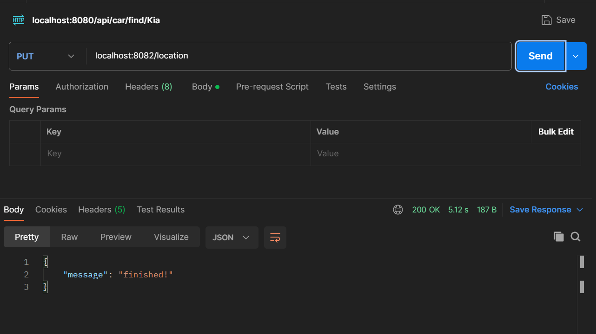
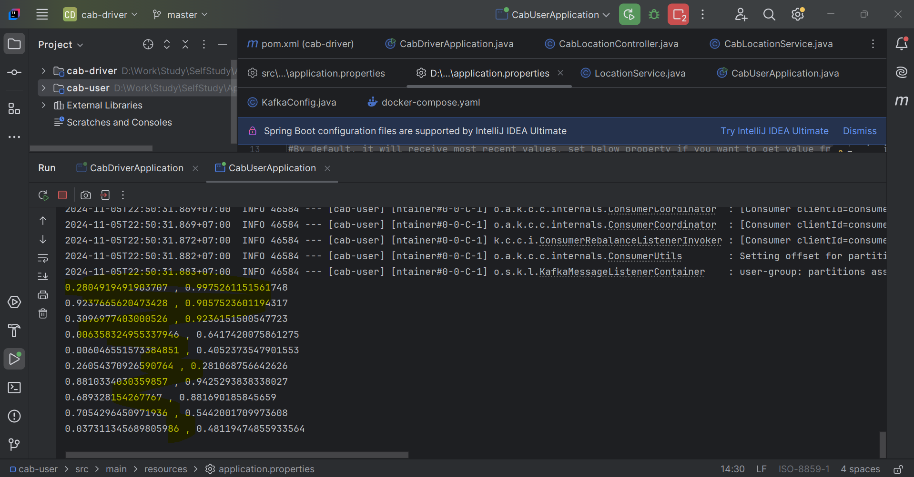

# Learning Apache Kafka
#### **Disclaimer:** this project is for myself learning how to use Kafka with Docker and SpringBoot with basic setup only. The notes about Kafka within this README file may not be correct due to I am still learning xD

## Kafka architecture  
Kafka Eco system:  
&nbsp;&nbsp;Kafka Clusters: perform the requests from senders and receivers (get data, send data)  
&nbsp;&nbsp;&nbsp;&nbsp;Broker 1  
&nbsp;&nbsp;&nbsp;&nbsp;&nbsp;&nbsp;Topic 1  
&nbsp;&nbsp;&nbsp;&nbsp;&nbsp;&nbsp;&nbsp;&nbsp;Partition 1 (and Offset setting)  
		
&nbsp;&nbsp;Zookeeper: manage Kafka Clusters and META data of senders and receivers  

*Notes:*
- Senders/Publishers/Producers: sending data to Kafka
- Receivers/Listeners/Consumers: receive data from Kafka
- Offset: control how Receiver will receive the data from a topic (from beginning, most recent, etc.)
- Group-id: define how messages shared among consumers/receivers

## Bootstrap Kafka server with Docker
> docker-compose up

The above command can be executed when inside cab-driver folder to run docker-compose.yaml file in the project and it will help to setup Kafka server + Zookeeper (confluent version)

## Run cab-driver application
Run it using intelliJ within the CabDriverApplication.java file

## Run cab-user application
Run it using intelliJ within the CabUserApplication.java file

Mock messages sent from Cab-Driver app are received by Cab-User after hit Send in Postman
